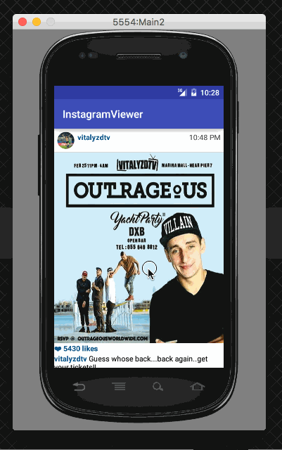

# Project 1 - *Instagram Viewer*

**Instagram Viewer** is an android app that allows a user to check out popular photos from Instagram. The app utilizes Instagram API to display images and basic image information to the user.

Time spent: **9** hours spent in total

## User Stories

The following **required** functionality is completed:

* [x] User can **scroll through current popular photos** from Instagram
* [x] For each photo displayed, user can see the following details:
  * [x] Graphic, Caption, Username
  * [x] Relative timestamp, like count, user profile image

The following **optional** features are implemented:

* [x] User can **pull-to-refresh** popular stream to get the latest popular photos
* [x] Show latest comment for each photo
* [x] Display each photo with the same style and proportions as the real Instagram (match\_parent and 2.25 inches in height (360dp), fixXY to stretch the image)
* [x] Display each user profile image using a RoundedImageViewDisplay each user profile image using a [RoundedImageView](https://github.com/vinc3m1/RoundedImageView)
* [x] Display a nice default placeholder graphic for each image during loading (white background seems to be less awkward)
* [x] Improved the user interface through styling and coloring

The following **bonus** features are implemented:

* [x] Show last 2 comments for each photo
* [x] Allow user to view all comments for an image within a separate activity or dialog fragment
* [x] Allow video posts to be played in full-screen using the VideoView
* [x] Apply the popular Butterknife annotation library to reduce view boilerplate.

The following **additional** features are implemented:

* [x] List anything else that you can get done to improve the app functionality!
  * Sticky header

## Video Walkthrough 

Here's a walkthrough of implemented user stories:

GIF created with [LiceCap](http://www.cockos.com/licecap/).

## Notes

Describe any challenges encountered while building the app.

* styling

  * Not sure how to control the weight of a RecyclerView inside a FragmentDialog. wrap\_content does not do the work.
  * Not sure if I shoudl stretch a VideoView or not.
  * Use span for styling text is hard (html is easier but span seems cooler...)

* Want to follow the iOS Instagram style that if you scroll through the
  pictures, the username (with the relative timestamp) row stays at the top for
  a while as you scroll the picture through it until you scroll to the point
  that another username row touches the bottom of the original username row.
  Not sure how to do this.

## Open-source libraries used

- [Android Async HTTP](https://github.com/loopj/android-async-http) - Simple asynchronous HTTP requests with JSON parsing
- [Picasso](http://square.github.io/picasso/) - Image loading and caching library for Android
- [ButterKnife](http://jakewharton.github.io/butterknife/) - Field and method binding for Android views
- [RoundedImageView](https://github.com/vinc3m1/RoundedImageView) - A fast
  ImageView (and Drawable) that supports rounded corners (and ovals or circles)
  based on the original example from [Romain Guy](http://www.curious-creature.org/2012/12/11/android-recipe-1-image-with-rounded-corners/)
- [StickyListHeaders](https://github.com/emilsjolander/StickyListHeaders) An alternate ListView that has sticky headers.

## License

    Copyright [2016] [Heung Tai]

    Licensed under the Apache License, Version 2.0 (the "License");
    you may not use this file except in compliance with the License.
    You may obtain a copy of the License at

        http://www.apache.org/licenses/LICENSE-2.0

    Unless required by applicable law or agreed to in writing, software
    distributed under the License is distributed on an "AS IS" BASIS,
    WITHOUT WARRANTIES OR CONDITIONS OF ANY KIND, either express or implied.
    See the License for the specific language governing permissions and
    limitations under the License.
